这篇文章从生信宝典中摘录并整理了内容。我也将会陆续更新相关知识。

<!--more-->

### 1. Linux 基本介绍及操作

- 

- 常用关于系统的命令

  - df - h  查看硬盘大小
  - pwd 当前目录

- 关于文档的命令

  - mkdir；cat (cat <<END 意思是 可以再终端中写入内容，直到输入END 写入才结束)； less； ls； tac 文档里的内容根据行反转， rev 根据列反转； rm (-rf); touch 创建新文件; head; tail --> tail -n +2 xxx 指的是从后往前读到第2行; ARGV[index] 可以取输入参数的名字； ARGIND 指的是参数的位置信息
  - man 查看function的帮助文档
  - cp; mv, rename (可用于批量修改名称) 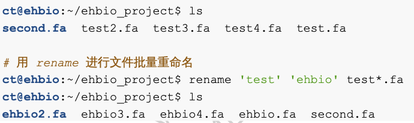
  - ln 创建软连接： 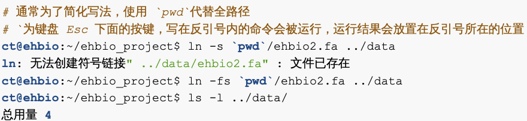 -f 强制覆盖原有连接  原文件的地址必须是绝对地址
  - 压缩与解压： gzip -c (输出到标准输出) xxx.fa;  gunzip xxx.gz 
  - wc -l xxxx.fa 显示文件行数 
  - grep 正则匹配 -c(count lines) 获取包含xxx 的行数; -v 不输出匹配上的行
  - sed 查找以及修改文档  如 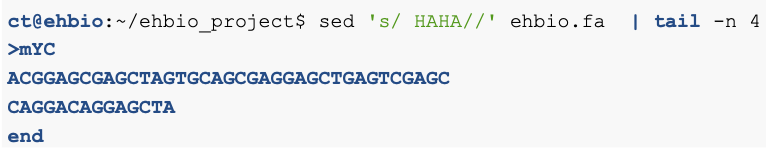
  - cut 适用于矩阵操作的删除 如 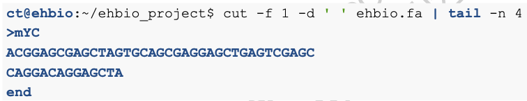 -f 指定第几行 可以是2, 2-5, 2,5 (第2 行，第2到5行，第2和5行)； -d 设置分隔符

- 常用快捷操作

  - ！加 之前输入过命令的前几个字符， 重新运行之前的命令
  - ctrl+a /e  回到首或者尾
  - ！！ 上一条命令； :gs 用于替换 如 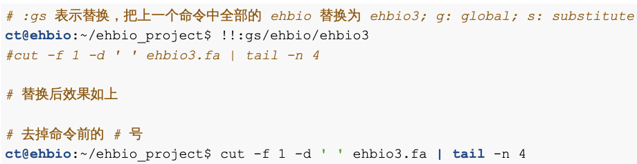

- Linux 下的输入，输出， 重定向，管道

  - < ; > ; | ; - 分别代表 输入，输出，管道，标准输入

  - 1 代表 标准输出， 2 代表 标准错误 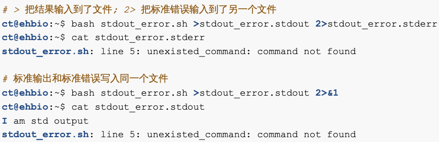

  - 关于 管道 和 - 应用 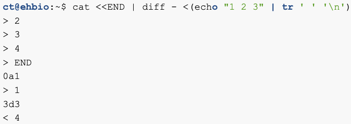 tr 是用于替换内容的function ； 

    另一个例子 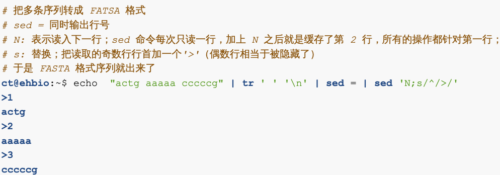

- Linux 文件内容操作

  - seq -s ' ' 1 2 10  生产1 到10 步长为2 并用空格分割的内容 

  - sort -u(unique 去除重复行) -n(按数值大小排 相当于 sort | uniq) 

    sort -n file | uniq -d 获得重复的行

    sort -n file | uniq -c 获得每行重复次数 

    sort -k2,2n 对比两列文件，按照第二列进行排列 

    sort -k2,2n -k1,1r 对比两列文件，按照第二列进行排列, 第二列相同的按照第一列倒序排列 

  - awk 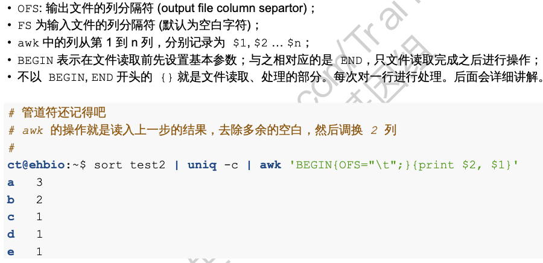

  - grep -A 1 'xxxx' abc.fa  匹配xxxx并且包含匹配行的下一行（-A 1）

  - 用 awk 或者sed 来处理 fasta 文件： 

    - 单行sequence 

      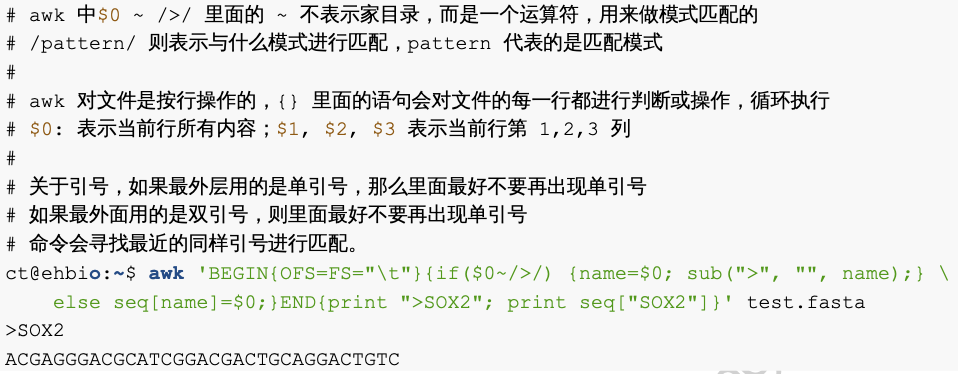

    - 多行sequence 

      - 方法1： 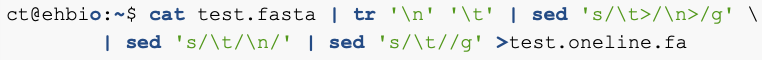  

        tr '\n' '\t' 将换行变成tab 

        sed 's/\t>/\n>/g' 将所有tab 加 > 的变成 换行加 >   g代表global 

      - 方法 2： 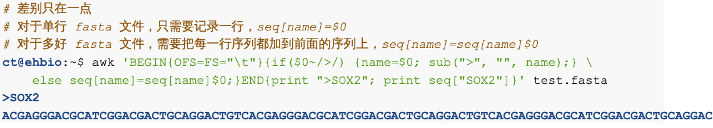

- Linux 命令运行 并且监测

  - 监测命令运行的时间 time command  如 time sleep 5 
  - top 查看正在运行的命令

### 2. Linux 软件安装

- 文件属性

  - rwx read(数字代表4)， write(2) , x execute 执行(1) 三个为一组，每组分别代文件所有者的权限，文件所有者所在组的用户组有的权限，最后是其他用户的权限

    a - all； u - user ； o - others； g - group

    \+ 增加权限 - 去除权限

  - chmod 更改文件或者文件夹属性 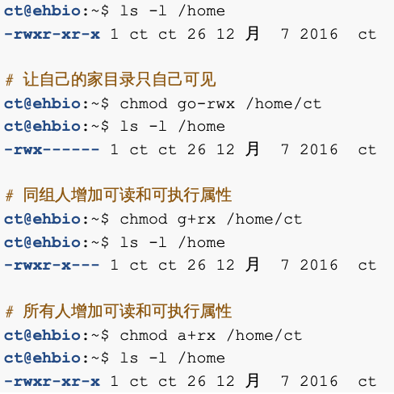

    chmod a+x file 给文件增加所有人(a) 可执行权限(+x) 

    chmod u+x file 所有者(u) 增加可执行权限(+x)

    chmod g+x, chmod o+x 组内(g) 或者 其他人(o) 增加可执行权限

    chmod 755 file 所有者读写执行的权限， 其他人读和执行的权限 (7 = 4+2+1, 5 = 4+1)

  - 环境变量$PATH  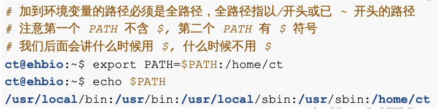

  - 常用的环境变量： 1.LD_LIBRARY_PATH 动态链接库(so 文件) 2. PYTHONPATH python 安装包位置 3. PERL5LIB perl 安装包路径

- 安装软件的几种方式

  - YUM

    - centos 中可以用 yum 
    - yum update 更新安装源； yum search name/description ; yum install xxxx 

  - wget 下载二进制文件

    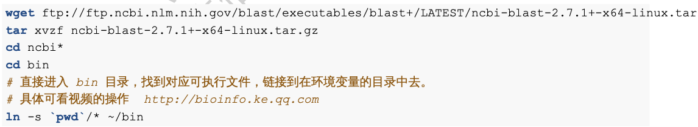

  - 源码编译安装

    - configure ， make ， make install 三部曲
    - configure 常用 --prefix = /home/ct/soft/specific_name 
    - 例子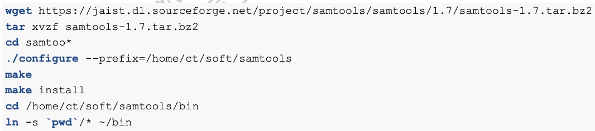
    - 其实具体的安装办法根据具体的软件来

  - 安装anaconda [安装包](https://www.continuum.io/downloads) ， bash Anaconda*x86_64.sh  

    常见问题

  - 安装R sudo apt-get install r-base  或者 yum install r-base  或者下载 源码

    -  

  - Conda 安装 - 通用包管理 -不仅仅是python

    [安装包](https://www.anaconda.com/download/#download) 安装步骤： bash Miniconda2-latest-Linux-x86_64.sh

    常用命令： 

    - conda list 

    - conda search xxxx

    - conda install xxx  / conda install xxx=1.4.2 

    - conda remove xxxx 

    - conda channels 

      channel 的配置文件在 ~/.condarc 里面

    - conda 创建环境流程 并且安装ete3

      1. conda create -n xxxx python = 3.6

      2. conda install -n xxxx -c etetoolkit ete3 ete3_external_apps  或者

         conda install -n xxxx ete3 ete3_external_apps

      3. 激活 与 失效 环境 source activate/deactivate xxxx 

    - 创建比对工具环境 

      	1. conda create -n aligners(环境名) bwa bowtie histat star ..等等软件名
       	2. conda install -n aligners hisat2 继续添加软件到指定环境
       	3. source activate / deactivate aligners

     - 移除 环境 conda remove -n xxxx --all

 - Make file 知识 -- 占坑

 - Docker 

    - 基本常识：

       - Images （超级轻量级的虚拟机的快照 - 也就是容器的只读版本） 和 container （可以安装软件， 运行程序的容器）
       - 一个container 通常只运行一个程序
       - 数据卷（Volumes） 永久保存数据的磁盘空间，可在不同容器间共享
       - Links 联通  容器间相互联通的方式 （ip）

    - 安装 

       - yum install docker-io / apt-get install docker.io

    - 添加权限

      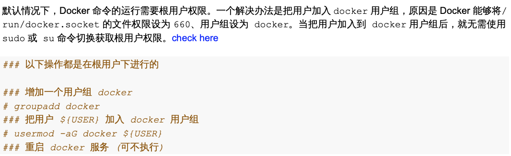

      ​               

      ​						只允许访问一个容器 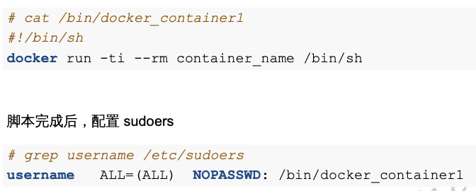

   - 使用Docker [初步教学](https://blog.saymagic.cn/2015/06/01/learning-docker.html)

     - 搜索镜像 docker search ubuntu 
     - 获取镜像 docker pull ubuntu / ubuntu:14.04 (指定版本号)
     - docker images 获取docker 中存在的镜像
     - 运行镜像 docker run --rm(运行完之后，这个容器就删除了) ubuntu echo "HELLO WORLD"
     - 交互式运行容器 docker run -it ubuntu, 这样用户名就会改变，似乎进入到当前容器中
     - 在容器中，我们可以安装变异软件包 和 R语言 apt-get install -y build-essential r-base
     - 列子 
     - 导出/入镜像  docker export image_id >ubuntu-dev.v1.tar  ;   cat ubuntu-dev.v1.tar | docker import - username/ubuntu-dev:v1 这里的username 可以被替换成在 Docker Hub 注册的名字， 来分享镜像， 通过 docker login 登录， docker push username/ubuntu-dev:v1 上传。 通过docker pull xxxx 来获取镜像

   - 基本操作

     - 

     - Dockerfile 实现自动化

       

### 3. LINUX 正则 以及常用工具

- AWK 

  - awk 'BEGIN{OFS=FS="\t"'} ARGIND==1 {print $0, $1;} ARGIND\==2 {print $0;}' file_1 file_2  

  - OFS: output field separator ; FS: field separator ; NF : number of fields (文件有多少列) ； NR(number of rows); FNR  当前文件读了多少行

  - a[$1] =1 索引操作

  - 常用函数 ： log2 ; int ; toupper; tolower ; $index~/pattern/ 匹配 ; split(\$index, name_for_split, split_pattern) 返回的值是一共分成了几块; system("xxxxxxx"); 

  - 例子

    1. 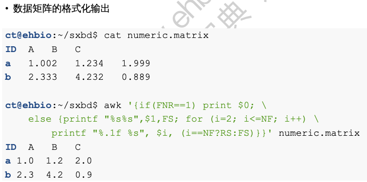

    2. 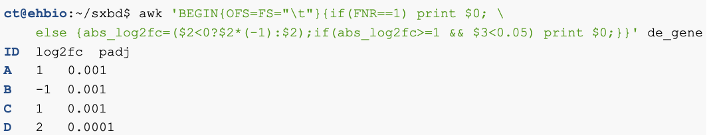

    3. 自定义函数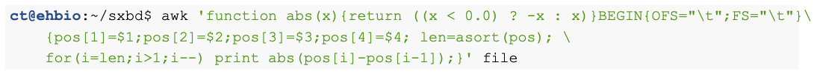

       看着里 ？ 的用法 ， 相当于R 里的 elseif 

    4. 引用系统变量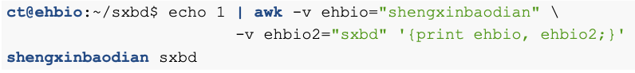

- SED 

  - s/pattern/replace/: 正则替换； i 前插行， a 后插行， c 替换行， d 删除行，p 输出行， N 读入下一行， 同时储存， n 读入下一行，抛弃当前行
- sed '2,$ s/_[0-9]//g' xxx 替换指定的第二行
  - sed 's/ /_/1' xxx 替换第一处出现的空格；sed 's/ /\_/2g' xxxx 替换第二处出现以及之后的空格
  - sed = xxxx 同时输出行号
  - 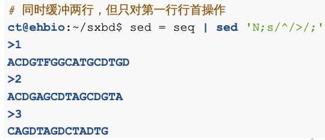
  - 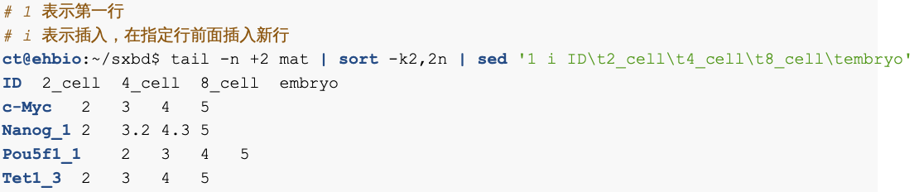
  - 提取指定或者特定范围内的行： sed -n '2,4p' xxxx; sed -n '4p' xxxx
  - 提取特定模式的行 sed -n '/_/ p' xxx 
  - 去除空行 sed '/^$/d' xxx 
  - 原位删除  sed -i '/^$/ d' xxxx 
  - 删除指定范围内的行 sed '2,3d' xxx 
  - 记忆匹配？  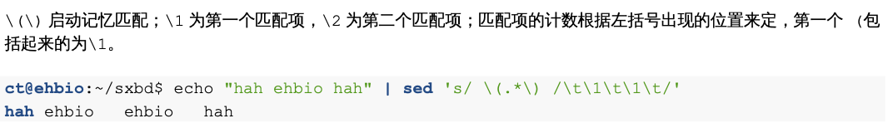
  - 奇偶数行的处理
    - 合并 sed 'N; s/\n/\t/ '
    - 取偶数行 sed -n 'n;p'
    - 只取奇数行 sed -n 'N; s/\n.*//;p'
  - 使用bash 变量
    - sed 's/$/\$xxxx/' \$xxxx 为bash 变量的名字
  - 将fasta 序列全都变成大写
    - sed -i '/\^[\^>]/ s/.*/\U&/ test.fa' 这里 \U 是大写 & 是全部匹配项

### 4. BASH 和 SHELL 相关

- varname=value  中间不能有空格

- 引用变量  $varname 或者 \${varname} 推荐第二种， 将变量导出可以是export varname

- $? (保存前一个命令的返回码， 0 为运行成功); \$\$(当前shell 的进程号) ; \$!(上个子进程的进程号)； \$#(传给脚本的参数数量，1 为只有脚本一个参数)； \$*, 和 \$@ 都是传给脚本的所有参数， 不包含脚本本身; \$IFS 分隔 （空格，TAB 再加换行）

- for i in xxx; do xxx; xxx; done

- if xxxx: then xxx; fi

- 字符串操作

  - 

  -  

    最后一个最常用， 例如： 

- SHELL 

  - 文件测试操作符

  - 字符串 str1=str2; str1!=str2; str1>str2 ; -n str 长度大于0 不为空； -z str str长度为0 为空

  - 整数操作符 -eq -ne -gt -lt -ge -le 

  - 逻辑操作 !;  && ;  ||; 

  - 流程控制

    - if 

      

    - for 

      

    - while 

      

    - case 

      

    - shift 将存放在位置变量中的命令行参数依次向左传递 

      

    - SHELL 函数

      - 定义方法 function function_name () { function body } 
      - 使用方法 function_name param1 param2 ... 

    - IO 

      - < 输入重定向； > 输出重定向 ； >> 输出重定向 ； << 输入重定向

      - 例子 

      - echo -n(取消输出后的换行) -e(启动转义序列) 

      - getopts "fs:ms:a\:s:as:X" xxx 前面是所有的可能参数

        

        ​				done

      - 进程 和 作业控制 

        - nohup command &  放入后台不中断运行
        - 其他 

==Questions:== 

1. 
2. what does usage mean in bash script.

==Reference:==

1. 生信宝典

